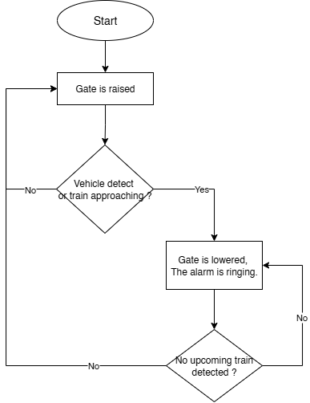

# Step 5 & 6: Planning and Implementing

## Word-Based Algorithm (Plain English Sequence of Tasks)

1. **Start System**  
   - Power on the railway safety control system.  

2. **Train Detection**  
   - Continuously monitor railway tracks with infrared sensors.  
   - If a train is detected → lower the gate.  

3. **Vehicle Detection**  
   - Continuously monitor the road crossing with infrared vehicle sensors.  
   - If a vehicle is detected on the track → lower the gate.  

4. **Gate Raising**  
   - If the train has completely passed AND no vehicles remain on the track → raise the gate.  

5. **Alerts and Signals**  
   - When gates are lowered, activate warning lights and/or bells to alert drivers and pedestrians.  

6. **Loop Monitoring**  
   - Return to continuous monitoring of trains and vehicles.  
   - Repeat the cycle indefinitely for ongoing safety.  

---

## Flowchart
The flowchart below represents the sequence above.

